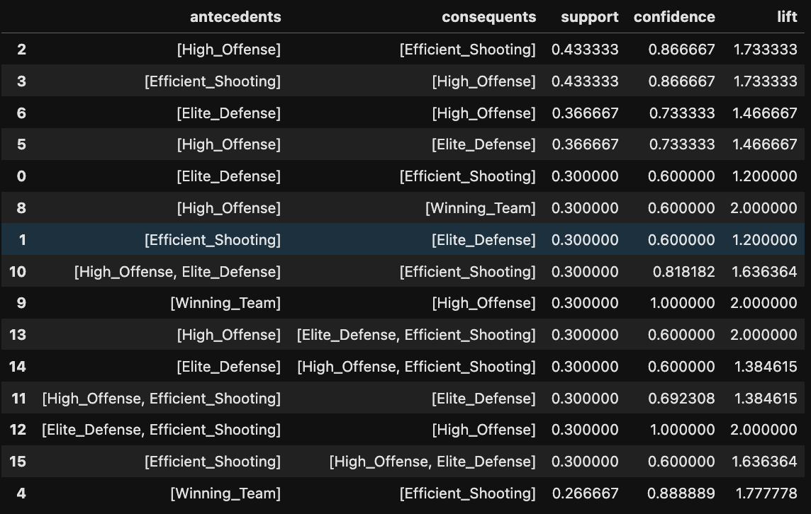
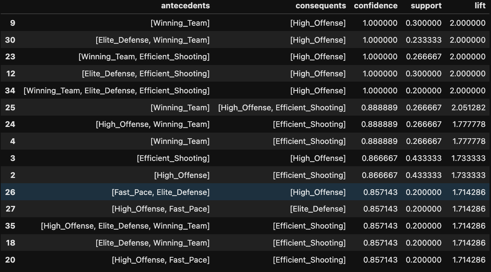
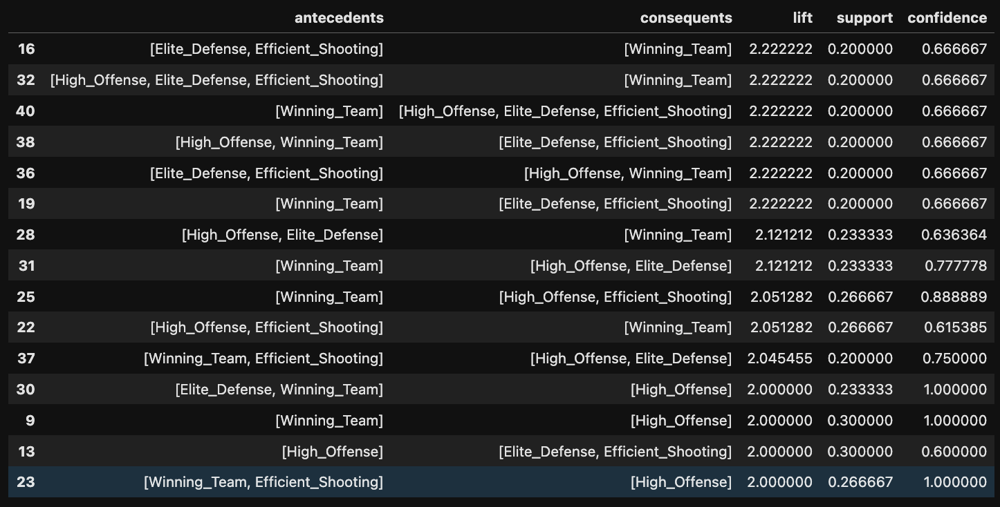

## Overview

ARM or Association Rule Mining is an algorithm that identifies associations or 'rules' within transactional data. A question as it pertains to this project might be: Is high defensive efficieny or high offensive efficiency more often associated with higher winning percentage?. In order to answer this question, tabular data is transformed into transactional through an encoding process where numeric values are placed into buckets such as: high, med, low defensive efficiency. ARM then uses the Apriori algorithm which is a technique used to find frequent itemsets the dataset by iteratively expanding item combinations and eliminating those that do not meet a minimum support threshold. It relies on the Apriori property, which states that if an itemset is frequent, then all of its subsets must also be frequent, allowing the algorithm to efficiently prune the search space. 

Support is just the frequency at which an itemset or rule appears in the dataset. Confidence is another measure which is used to evaluate the strength of that frequnecy, so given that item A exists, how often do items A and B exist together. And lastly, lift is used to evaluate whether or not this coocrruence is due to random chance or not where lift values below 1 indicate a negative correlation, lift values of 1 indicate no correlation, and lift values greater than one indicate a positive correlation. 

---
## Data Prep

To apply Association Rule Mining, the structured tabular data must first be transformed into transactional format, where each row represents a “basket” of categorical items rather than continuous numerical values. This is done by discretizing numeric features (e.g., offensive rating, defensive rating, win percentage) into categorical buckets such as high, medium, or low, and then encoding each team-season observation as a set of labeled attributes (e.g., High_OFF_RATING, Low_DEF_RATING, High_W_PCT). Below is an example of what those observations look like in transaction format.

Code and data linked below:

---
## Code / Data Link

  <strong>
    <a href="https://github.com/maxjwhite/csci5612ML-NBACode">ARM Script</a>
     &nbsp;|&nbsp;
    <a href="https://github.com/swar/nba_api">Link to Data</a>
  </strong>

---
## Results

The dataset that is being used operates on a relatively small number of obersvations. Since we're looking at only 30 teams, the min support threshold needs to be adjusted accordingly to a relatively low level in order to capture meaningful rules. Otherwise, a majority of rules would be excluded from the get go. This process was just a matter of setting and lowering the min support until the rules we're capturing meaningful associations, this was also identified by checking to see if rules we're being bottlenecked and sat largely around the min support level which indicated that the min support was possibly too high. The min confidence level sat between 0.6 and 0.7, since it was still important to capture significant patterns and associations within the datasaet. 

Results for top 15 rules by support, confidence, and lift shown below:

Moving forward, and while this does capture meaningful associations within the dataset, it is restricted to the 2024-25 season which exists in an isolated context. Do these rules still apply over the past 5 years? What about 10 or 15? Or even the last 50? There are modifications that can be made to the arm script by adjusting the season list variable which allows to explore these rules over a longer period of time. 

---
## Conclusions

In conclusion, high offensive efficiency is the most important attribute when it comes to associations connected to winning. High shooting efficiency ==> high offensive efficiency and vice versa, which makes sense and While defensive efficiency is also strongly connected to winning, it is more of a supplement to high offensive pressure. It's like the old saying, the best defense is a good offense where constant offensive pressure puts opponents in a position where they need to make shots and stronger offensive teams can afford to make more mistakes on defense. 

