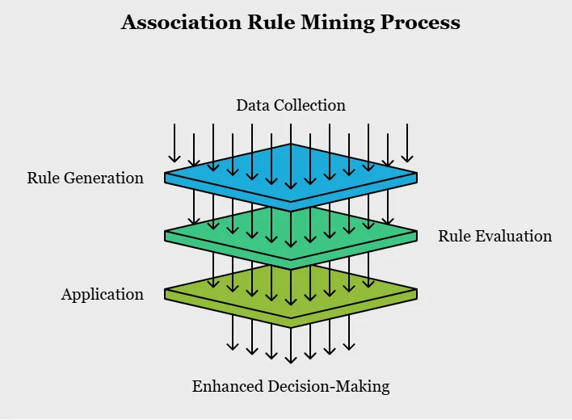
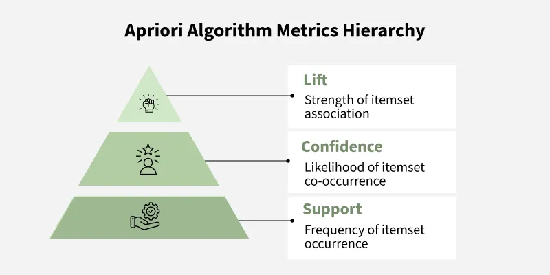
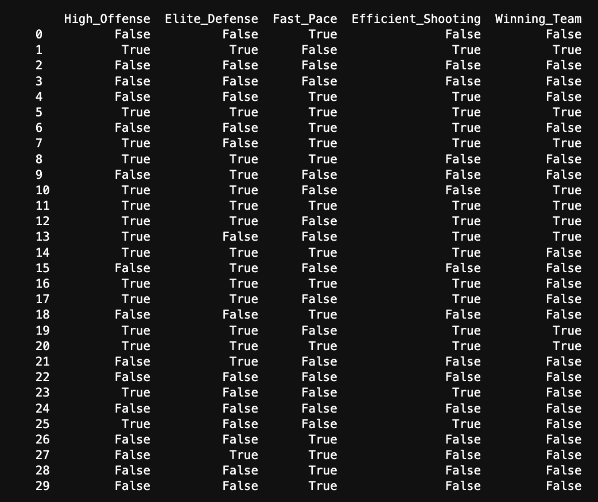

## Overview

ARM or Association Rule Mining is an algorithm that identifies associations or 'rules' within transactional data. A question as it pertains to this project might be: Is high defensive efficieny or high offensive efficiency more often associated with higher winning percentage?. In order to answer this question, tabular data is transformed into transactional through an encoding process where numeric values are placed into buckets such as: high, med, low defensive efficiency. ARM then uses the Apriori algorithm which is a technique used to find frequent itemsets the dataset by iteratively expanding item combinations and eliminating those that do not meet a minimum support threshold. It relies on the Apriori property, which states that if an itemset is frequent, then all of its subsets must also be frequent, allowing the algorithm to efficiently prune the search space. 

Support is just the frequency at which an itemset or rule appears in the dataset. Confidence is another measure which is used to evaluate the strength of that frequnecy, so given that item A exists, how often do items A and B exist together. And lastly, lift is used to evaluate whether or not this coocrruence is due to random chance or not where lift values below 1 indicate a negative correlation, lift values of 1 indicate no correlation, and lift values greater than one indicate a positive correlation. 

---
(b) Data Prep. All models and methods require specific data formats. ARM requires ONLY unlabeled transaction data. Explain this and show an image of the sample of data you plan to use. LINK to the sample of data as well. 

---
## Code

  <strong>
    <a href="https://github.com/maxjwhite/csci5612ML-NBACode">ARM Script</a>
    <a href="https://github.com/swar/nba_api">Link to Data</a>
  </strong>

---
## Results. Discuss, illustrate, describe, and visualize the results. 
Include the top 15 rules for support, the top 15 for confidence, and the top 15 for lift. What thresholds did you use? Include at least 1 visualizations (network) that show the associations you found. 

---
## Conclusions. What did you learn that pertains to your topic?

