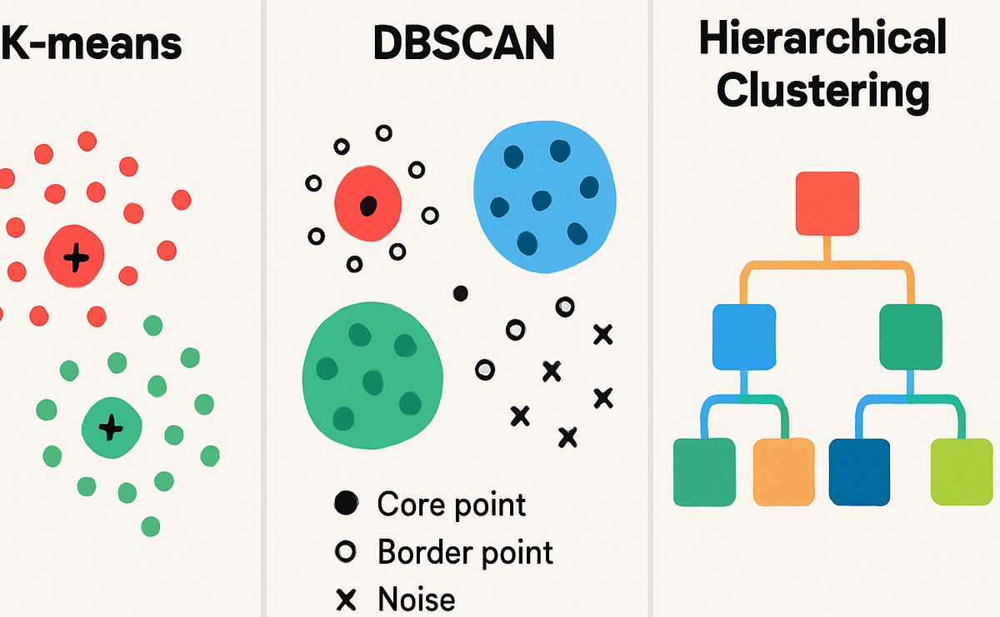
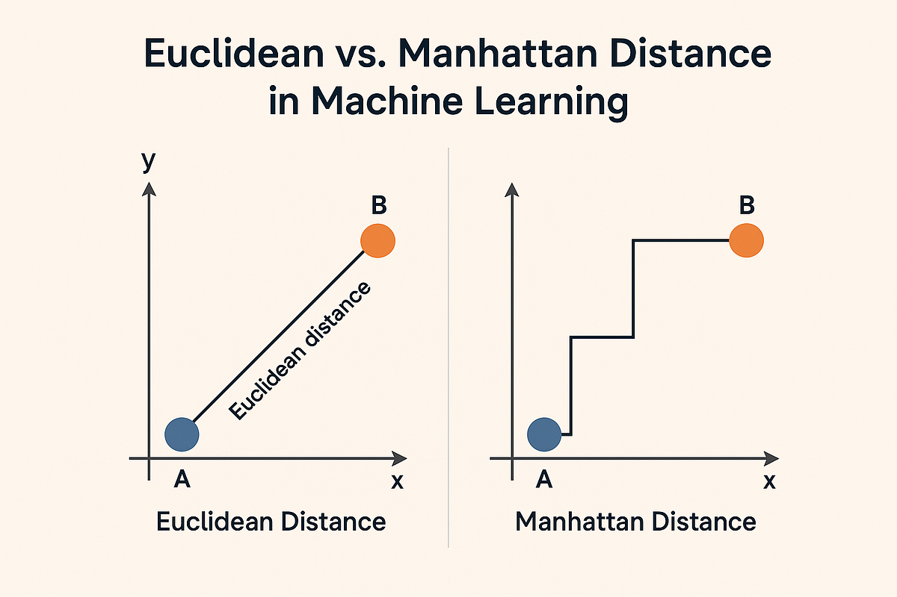
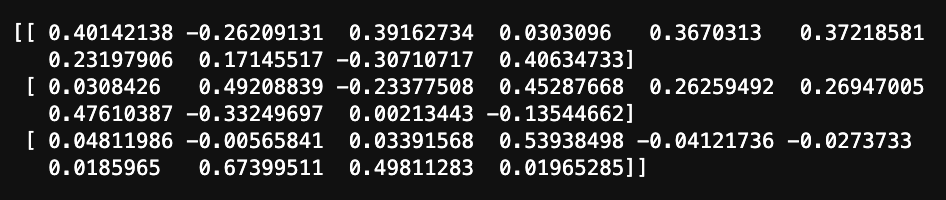
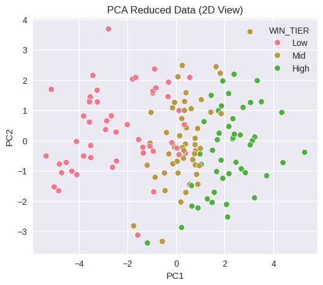
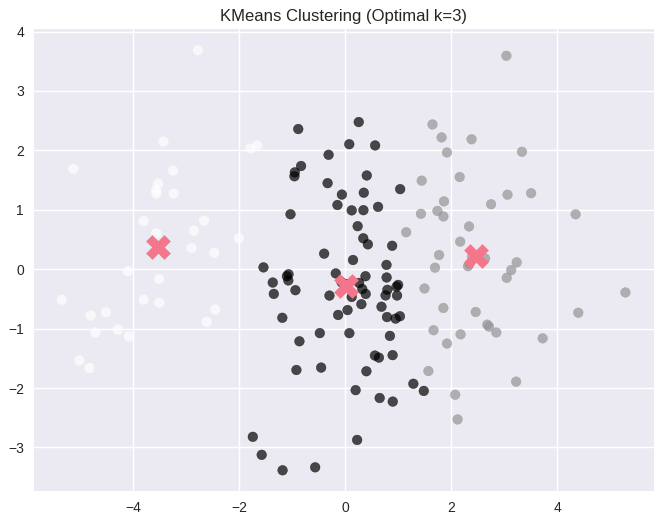
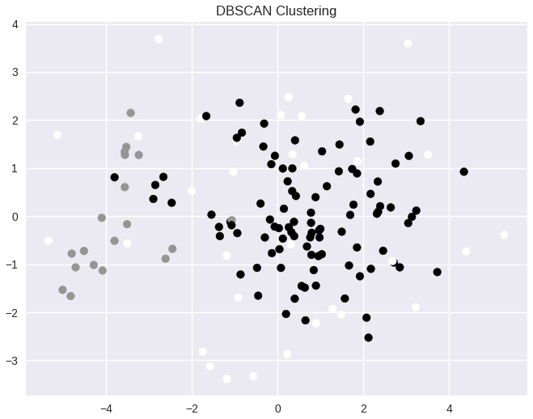
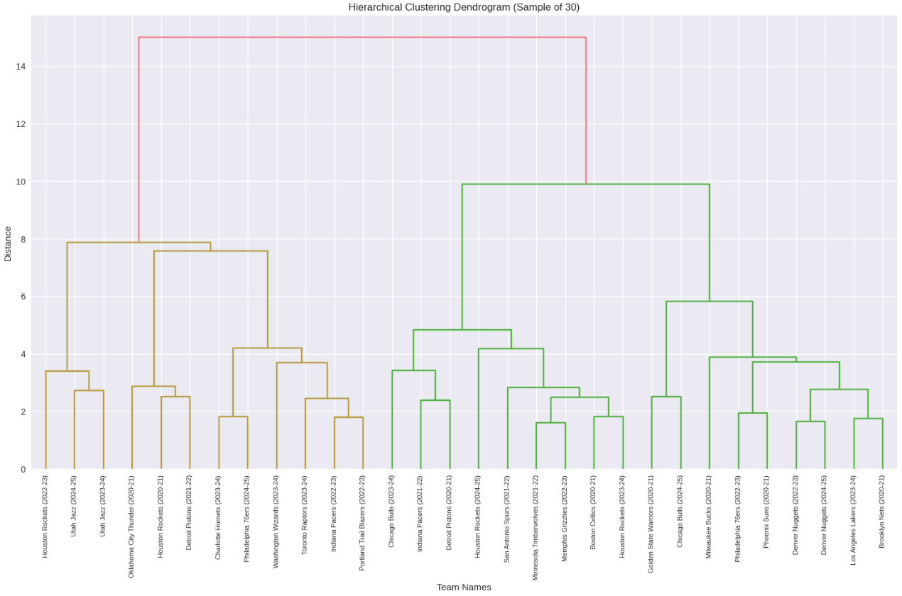

## Overview

We performed unsupervised clustering on NBA team performance data across five seasons using advanced team metrics (offensive rating, defensive rating, net rating, pace, efficiency metrics, etc.). After cleaning the dataset and separating win percentage as a reference label, all features were standardized to ensure equal contribution to distance calculations. To reduce dimensionality and remove redundancy, we applied Principal Component Analysis (PCA), retaining three components that preserved most of the dataset’s variance. Clustering was then performed using three methods:

* KMeans (centroid-based)
* Hierarchical clustering (agglomerative, Ward linkage)
* DBSCAN (density-based)

Each method was evaluated using silhouette scores, cluster counts, and visual inspection in PCA space to compare structure and interpretability. Note that not all of these methods use the same approach when it comes to distance. Distance being the measure of importance and the means by which clusters are defined. When two or more observations (in this case nba teams) are close in distance, they are clustered together, but how we define distance alters how those clusters are formed. In the case of KMeans, a centroid or 'mid point' is randomly selected and at each iteration, all other points euclidean distances are calculated from each centroid and assigned to the closest accordingly. Then the centroids are then recalculated based on the average distance to all the points in it's cluster. This two step approach iterates over and over until covergence is reached. In the case of DBSCAN, clusters are formed based on their density or proximity to other nearby points which is adjusted by fine tuning the epsilon and min number of items per group parameters. Other distance measures exist such as manhattan distance or even other non-euclidean types such as cosine similarity all of which have applications in other types of problems. 

---
## Data Prep / Code

Utilizing the team data endpoint from the nba_api. We can isolate numeric features and create/isolate our label feature in order to perform clustering methods. Before continuing with the clustering however, PCA will be applied to the dataset in order to consolidate our features into 3D space in order to make visualization possible. Otherwise, we would have to consider how to plot OFF_RATING, DEF_RATING, NET_RATING, PACE, TS_PCT, EFG_PCT, ETC. 

  <strong>
    <a href="https://github.com/maxjwhite/csci5612ML-NBACode">ARM Script</a>
     &nbsp;|&nbsp;
    <a href="https://github.com/swar/nba_api">Link to Data</a>
  </strong>

---
## Results

Based on our elbow plot and along with the silhoutte score, the desired number of groups (k) wasa determined to be 3. This was then used in our KMeans algorithm to cluster our nba team data into 3 distinct clusters. What this reveals are groupings of teams based on performance with higher performing, average performing, and under performing teams grouped with one another. 

  DBSCAN shows some more ambiguous cluster types whilst also identifying 'noise' or points which don't belong to any cluster whatsoever. In this case, it more clearly groups average and higher performing teams together, whilst isolating lower performing teams in a separate group. We can validate this by looking back at our PCA plot with our clustering labels. 

  The dendrogram shows more intimate connections between individual teams whilst also showing how those connections are a part of a larger grouping of teams. BAsed on the pairings, these findings seem to support the cluster types that were identified using DBSCAN. 

---
## Conclusions

 Across all three clustering methods, consistent structural patterns emerged in NBA team performance over the five-season span. KMeans produced the clearest and most interpretable clustering, identifying three distinct clusters that align closely with intuitive performance tiers: high-performing, average, and underperforming teams. The silhouette analysis sand elbow plot upported this, suggesting that a three-cluster solution best captured the natural structure of the data under a centroid-based framework. 

 

 Hierarchical clustering further reinforced these findings by revealing nested relationships between teams. The dendrogram illustrated how closely related teams merge into broader groupings, providing additional interpretability beyond flat clustering assignments. This method highlighted the gradual performance spectrum that exists across teams rather than sharply separated categories. 
 

 DBSCAN, while useful for identifying density-based structures and noise, proved less effective for this dataset. Parameter tuning revealed relatively weak silhouette scores and a substantial proportion of noise points. In other words, team performance appears to vary along a smooth competitive gradient rather than forming naturally isolated density groups. 
 
