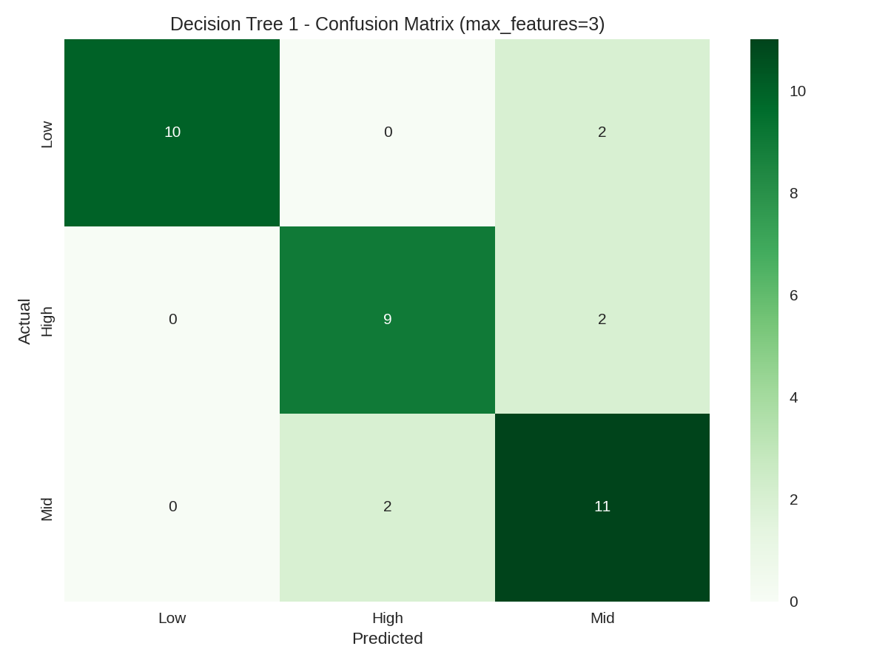
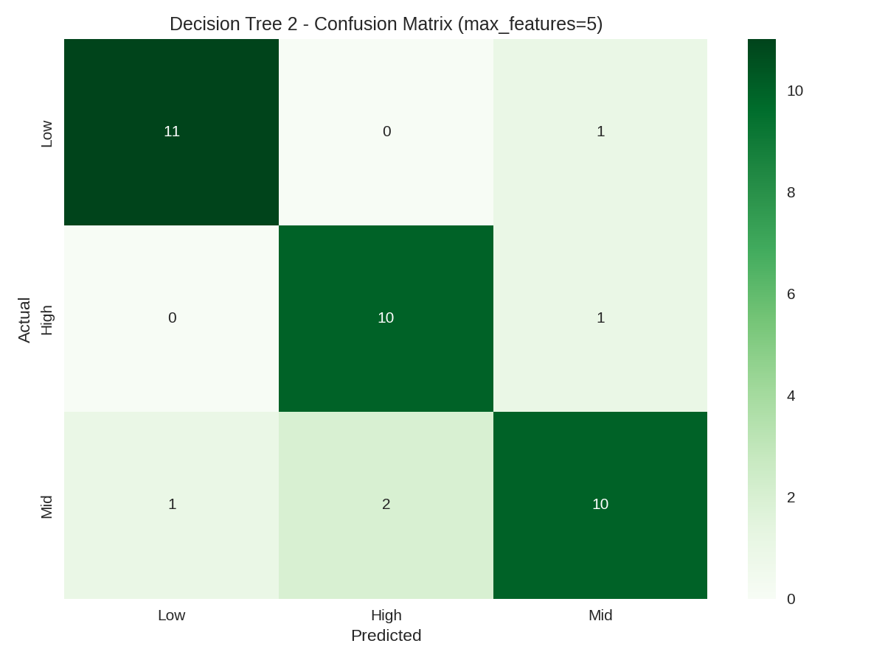
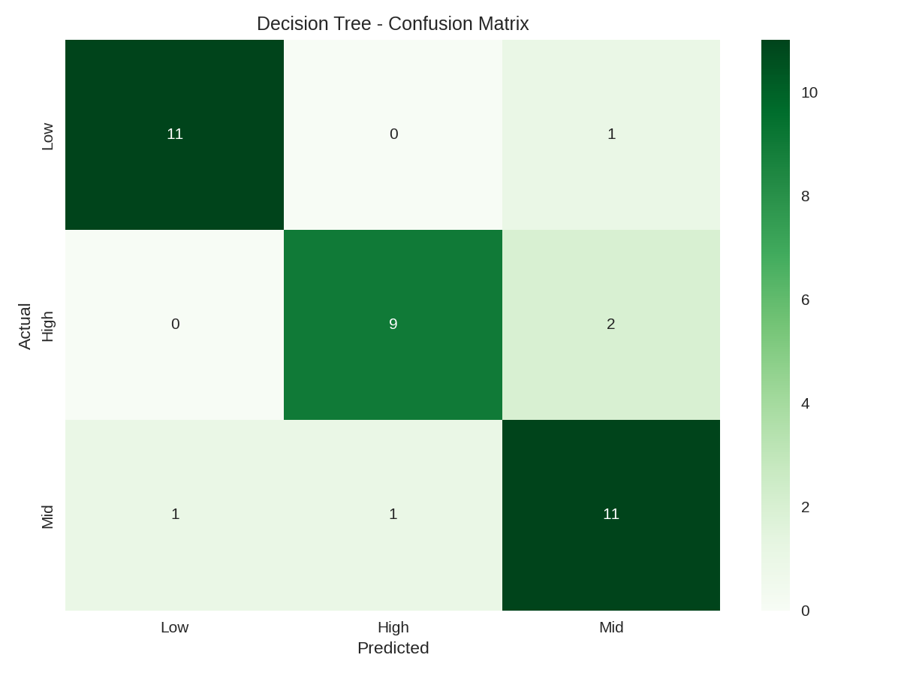
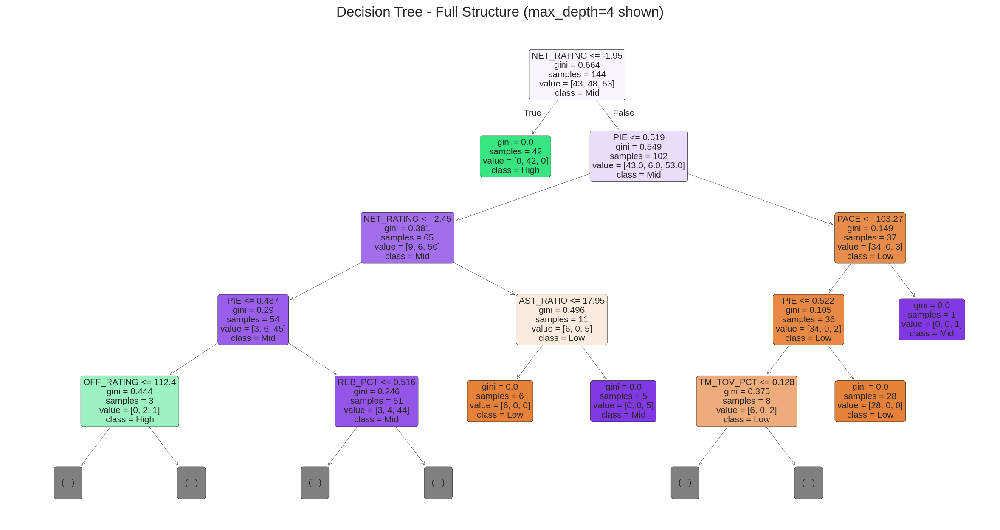
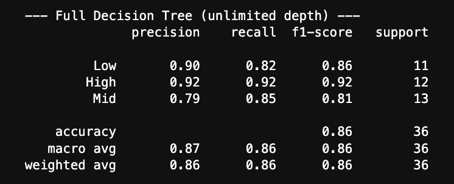

Decision Trees (DT) is a type of supervised learning model used for classification and regression. Supervised learning simply means that when we train our models, there are labels attached to the data which are essentially targets or classifications. These models work by breaking the data into subsets based on certain features where each break essentially becomes a new branch and each branch end becomes a node or leaf, making up a decision tree. A brief example using data on clothes: first split breaks into tops and bottoms, each leaf of this (top / bottom) then breaks again into (short / long). This simple tree now classifies clothes from unlabaled objects into short sleeve, long sleeve, shorts, and pants. But how does the model determine where these splits are made? 

In order to make the best splits in the data, DTs use purity scores such as Gini and Entropy, which measure how mixed the classes are within each node. For example, the top node might contain four classes: t-shirt, sweater, tank top, and hoodie. Each possible split is evaluated using Information Gain, which calculates how much the split reduces uncertainty or disorder in the node. The split that maximizes Information Gain is chosen, creating child nodes that are more “pure” and better separated by class. Decision Trees can theoretically grow infinitely because you can continue splitting nodes or pick new thresholds for continuous features, producing countless possible tree structures. In practice, constraints like maximum depth, minimum samples per leaf, or pruning are applied to prevent overfitting and ensure the tree generalizes well to new data.

---
## Data Prep

In order to prepare the NBA team data for the decision tree model, we followed a similar process to how we prepared our Naive Bayes model. Advanced team statistics we selected as features, including OFF_RATING, DEF_RATING, NET_RATING, PACE, TS_PCT, EFG_PCT, AST_RATIO, REB_PCT, TM_TOV_PCT, and PIE. The target variable, WIN_TIER, categorizes teams into Low, Mid, or High winning tiers based on quantiles of their winning percentage (W_PCT). After cleaning the data and removing missing values, we prepared the features (X) and target (y) for modeling. The data was then split into train test splits  at a 80/20 split, and we also ensured this was done using a stratified sample in order to get a sample of nba teams across several years, otherwise one nba season might only exist in our train or test split which could skew accuracy scores. It's important that these are disjoint in order to ensure that we aren't validating our model based on data the model has already seen, this would cause accuracy score to inflate and potential overfitting. 

---
## Code

  <strong>
    <a href="https://github.com/maxjwhite/csci5612ML-NBACode">Decision Tree Script</a>
    &nbsp;|&nbsp;
    <a href="https://github.com/swar/nba_api">Link to Data</a>
  </strong>

---
## Results

---
# Conclusions

The full decision tree achieved an overall accuracy of 86% on the test set, with strong precision and recall across all tiers (Low 0.90/0.82, Mid 0.79/0.85, High 0.92/0.92). Most misclassifications occurred between adjacent tiers, such as Mid and High, which aligns with expectations since teams near the cutoff are harder to categorize. These results suggest that decision trees can reliably predict team winning tiers from advanced statistics and identify the features most closely associated with team success. This approach provides a foundation for further exploration, including expanding the dataset to more seasons, incorporating additional performance metrics, or comparing tree-based methods with other classifiers such as Naïve Bayes or ensemble models.

