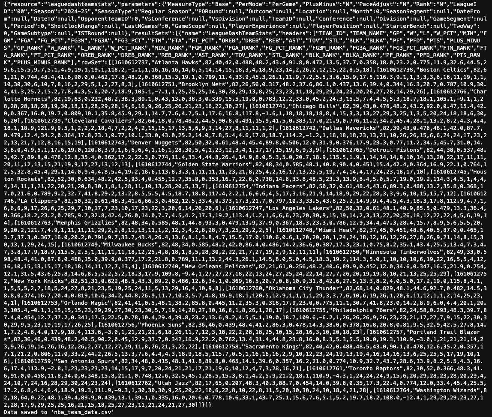
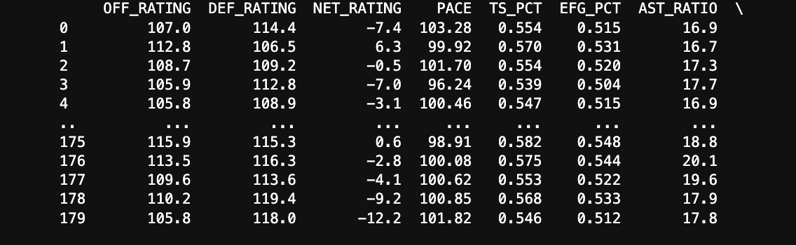
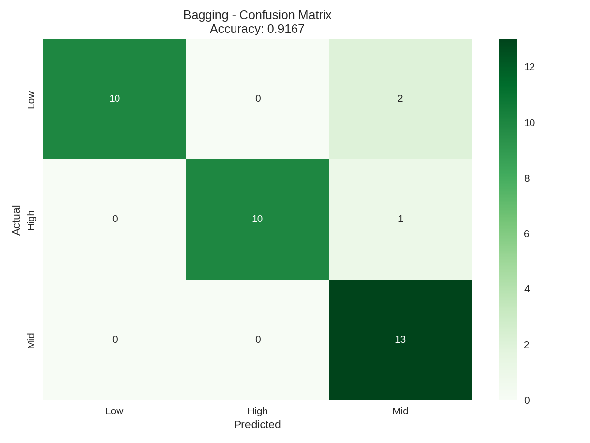
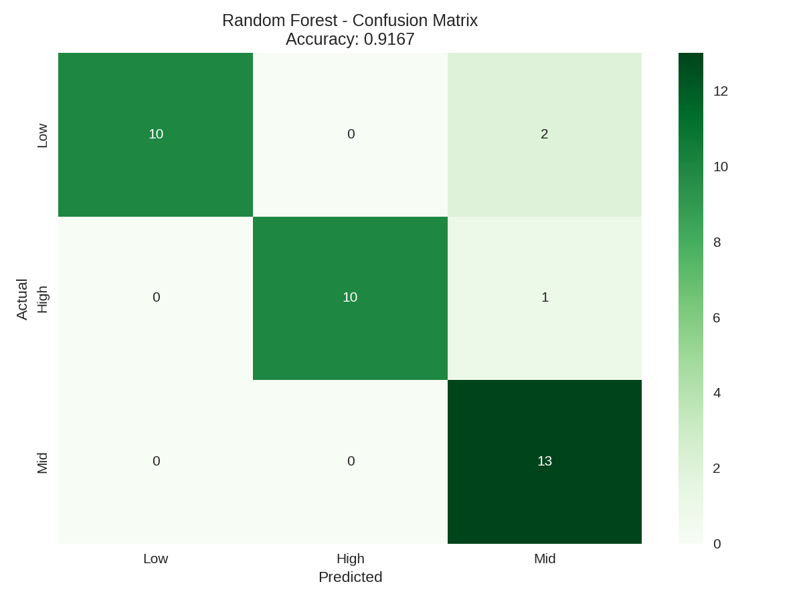
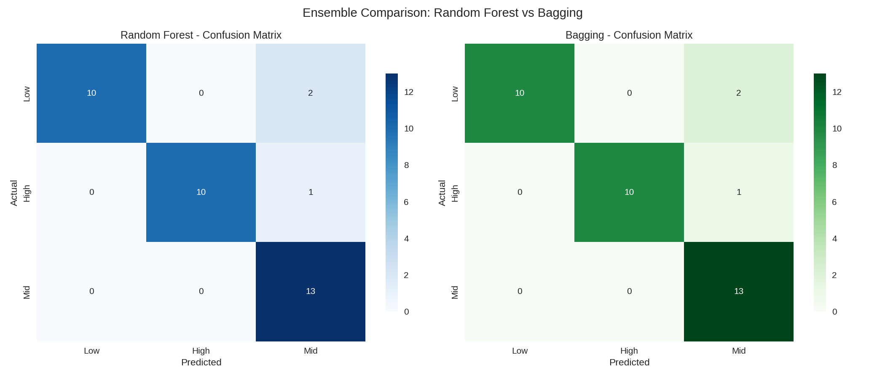

Ensemble methods combine multiple models to produce a single, more reliable prediction, rather than relying on just one model alone. The idea is that while individual models may make mistakes, combining many of them can reduce overall error and improve stability. Techniques like bagging build many decision trees on different subsets of the data and average their results, while methods like random forests add additional randomness to improve performance and reduce overfitting. In this project, ensemble models help capture complex relationships in NBA team performance by leveraging the strengths of multiple decision trees. Overall, they provide a powerful way to improve accuracy and reinforce patterns that may not be captured by a single model.

---
## Data Prep

Team-level statistics were collected from multiple NBA seasons and combined into a single dataset, focusing only on advanced performance metrics such as offensive rating, defensive rating, shooting efficiency, and rebounding percentage. Any missing values were removed to maintain data quality and avoid issues during model training. A target variable was then created by grouping teams into three categories—Low, Mid, and High—based on their win percentage. Following this stepIt was important that we created a training/test split in order to verify the accuracy. It's important that these two sets are disjoint, otherwise our test set would exist in our model's training set and thus would skew accuracy. 

---
## Code

  <strong>
    <a href="https://github.com/maxjwhite/csci5612ML-NBACode">NB Script</a>
    &nbsp;|&nbsp;
    <a href="https://github.com/swar/nba_api">Link to Data</a>
  </strong>

---
## Results

The ensemble models demonstrated strong and consistent performance in classifying NBA teams into Low, Mid, and High win tiers. Both the Random Forest and Bagging classifiers achieved an identical accuracy of 91.67%, indicating that ensemble approaches are highly effective for this task. Performance was well-balanced across all three classes, with particularly strong recall for Mid-tier teams and perfect precision for both Low and High tiers in many cases. The confusion matrices show that most errors occurred between neighboring categories (such as Mid vs. High), rather than extreme misclassifications, suggesting the models captured meaningful structure in the data.

---
## Conclusions

The ensemble results further reinforce the central finding of this project: successful NBA teams are defined by a combination of strong, balanced performance metrics rather than any single factor. The high accuracy achieved by both Random Forest and Bagging models indicates that these patterns are not only observable but also highly predictable. Additionally, the fact that two different ensemble approaches produced identical results suggests that the underlying structure in the data is stable and robust.

