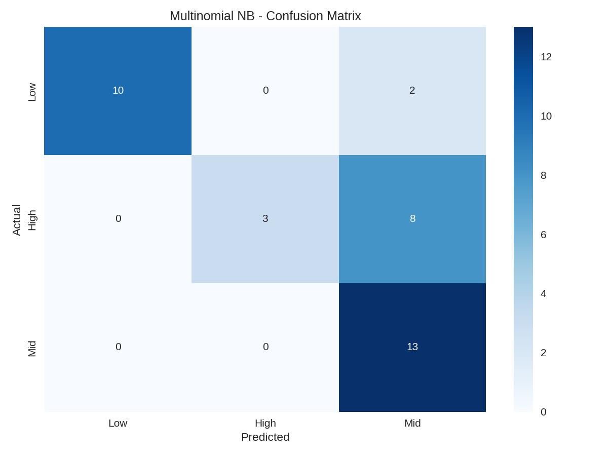
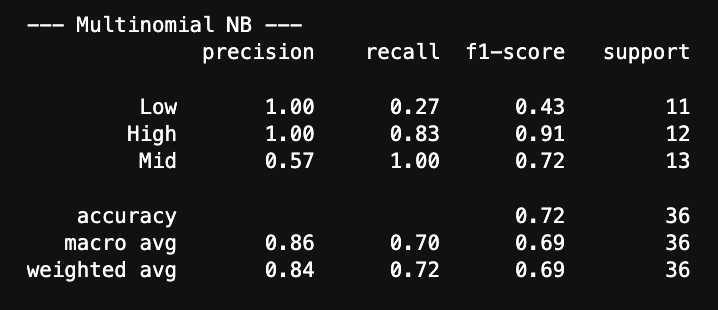
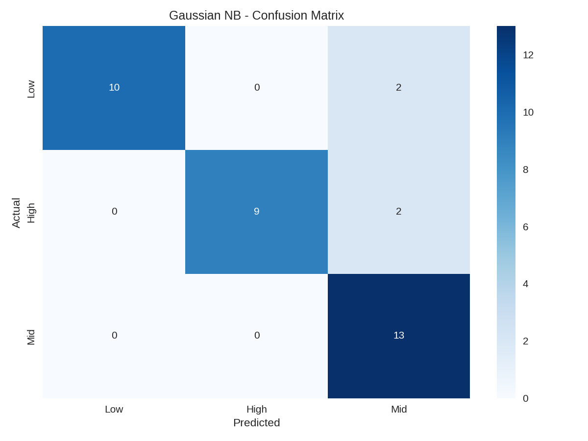
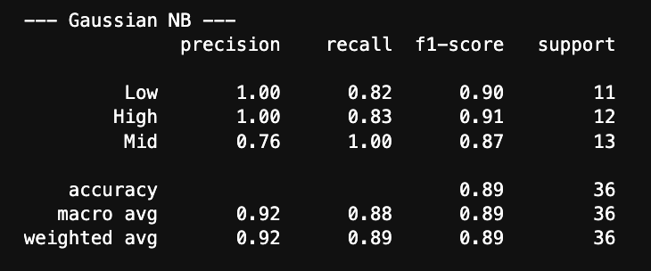
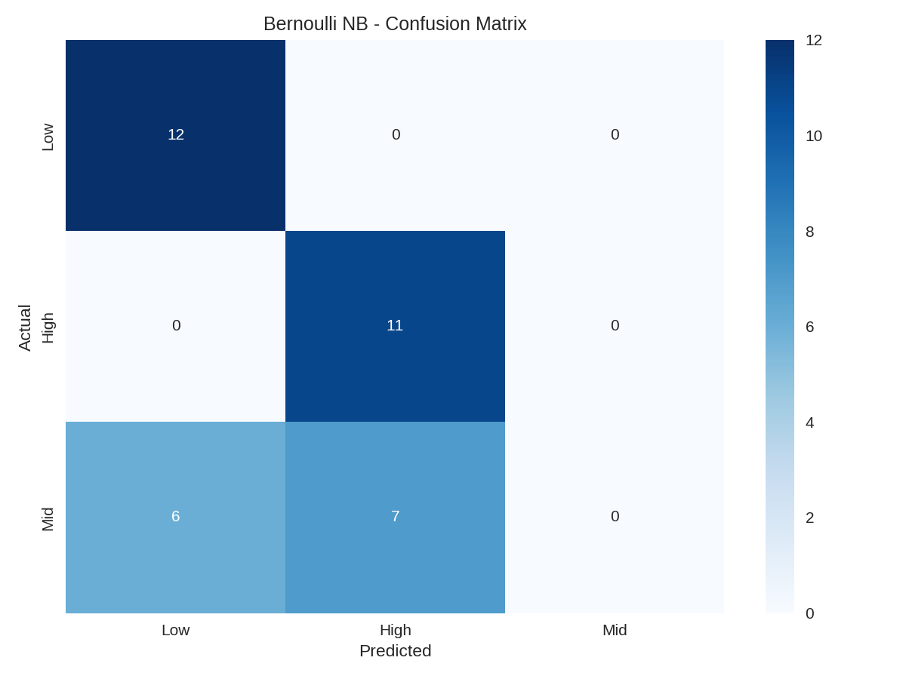
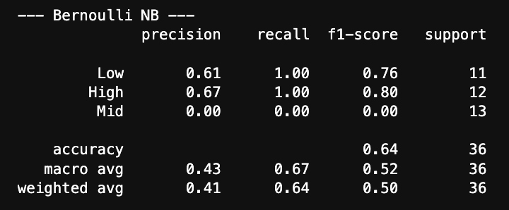

Naive Bayes is a classification model which assigns probabilities to data points which measure the likelihood of that data point belonging to a particular class. This model is based on the conditional probability formula or 'Bayes Theorem' which calculates the probability of a certain event given another related event is seen to be true. An example of this would be: what is the probability of it raining today given there are clouds in the sky. What naive means in this case is that the model is assuming that all features are independent of one another which drastically simplifies the computations necessary to assign probabilities, but the trade off is that by relying on this assumption, you have to ensure that there are not highly correlated or dependent features in the dataset. This model is typically used for spam message detection and sentiment analysis and there are several different variations which allow for a broad range of applications. For instance: Guassian NB is used for continuous numerical data and also relies on the assumption that the data is normally distributed, and Multinomial NB is more suited for discrete count based data. Additionally, there is also the Bernoulli NB which is used for binary features and Categorical NB which is used for discrete non binary categories. 

In the case of this project where a majority of the data is continuous, it would be most appropriate to apply Guassian NB, but there may be applications for the other types. This process is just about exploring multiple different methods and comparing/contrasting the performance of them all in order to find the best fit.

---
## Data Prep

All supervised learning models require properly labeled and formatted data. In this project, NBA team statistics were collected and used to create a classification target, WIN_TIER, by grouping teams into Low, Mid, and High categories based on win percentage. The feature set includes advanced metrics such as offensive rating, defensive rating, pace, and shooting efficiency. To evaluate model performance, the dataset was split into a training set (used to build the model) and a testing set (used to evaluate performance on unseen data). These sets must be disjoint to avoid data leakage, ensuring that model accuracy reflects true generalization rather than memorization.

Different Naïve Bayes variants require different data formats, so multiple preprocessing steps were applied. Multinomial Naïve Bayes requires non-negative inputs, so features were scaled using MinMaxScaler. Gaussian Naïve Bayes assumes continuous, normally distributed data and was applied directly to the original features. Bernoulli Naïve Bayes requires binary inputs, so features were converted using binarization. As a result, each model uses a slightly different version of the dataset.

---
## Code

  <strong>
    <a href="https://github.com/maxjwhite/csci5612ML-NBACode">NB Script</a>
    &nbsp;|&nbsp;
    <a href="https://github.com/swar/nba_api">Link to Data</a>
  </strong>

---
## Results

Based on the results above, it is apparent that Guassian Naive Bayes performed the best out of the three and this was to be expected given that this model is best suited for contiunous data, which makes up the maority of the NBA stat data.

---
## Conclusions

Across the Naïve Bayes models, we were able to classify teams into Low, Mid, and High win tiers with measurable accuracy, demonstrating that even relatively simple probabilistic models can capture meaningful patterns in NBA data. Comparing different Naïve Bayes variants highlighted how data representation impacts model performance. Gaussian NB performed the best with continuous features, while Multinomial and Bernoulli required transformations that sometimes reduced overall performance. This suggests that the underlying distribution of basketball statistics is better suited to continuous assumptions rather than discrete or binary ones.

