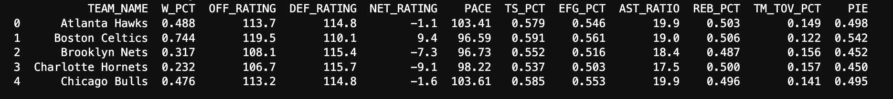
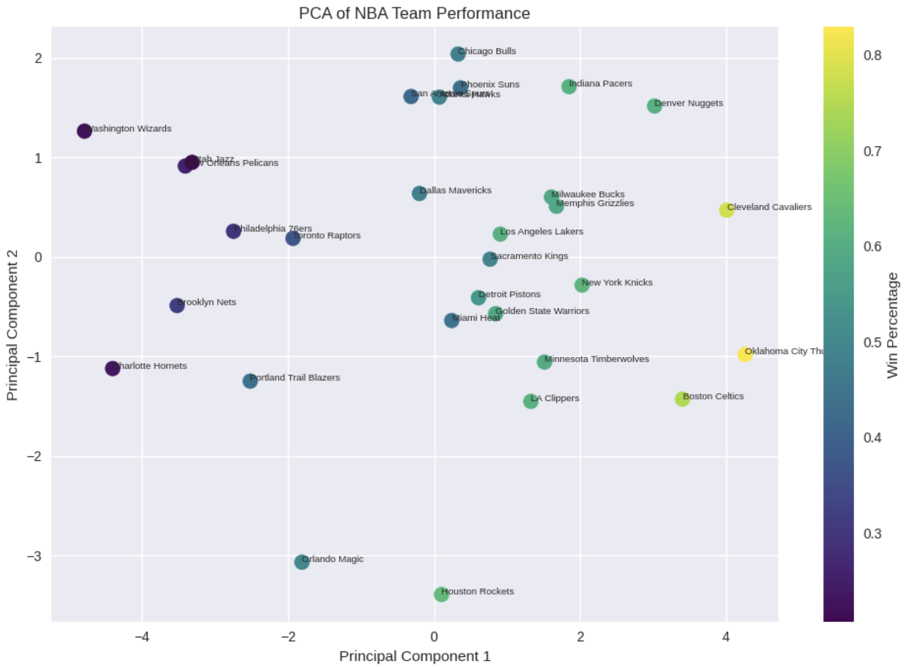
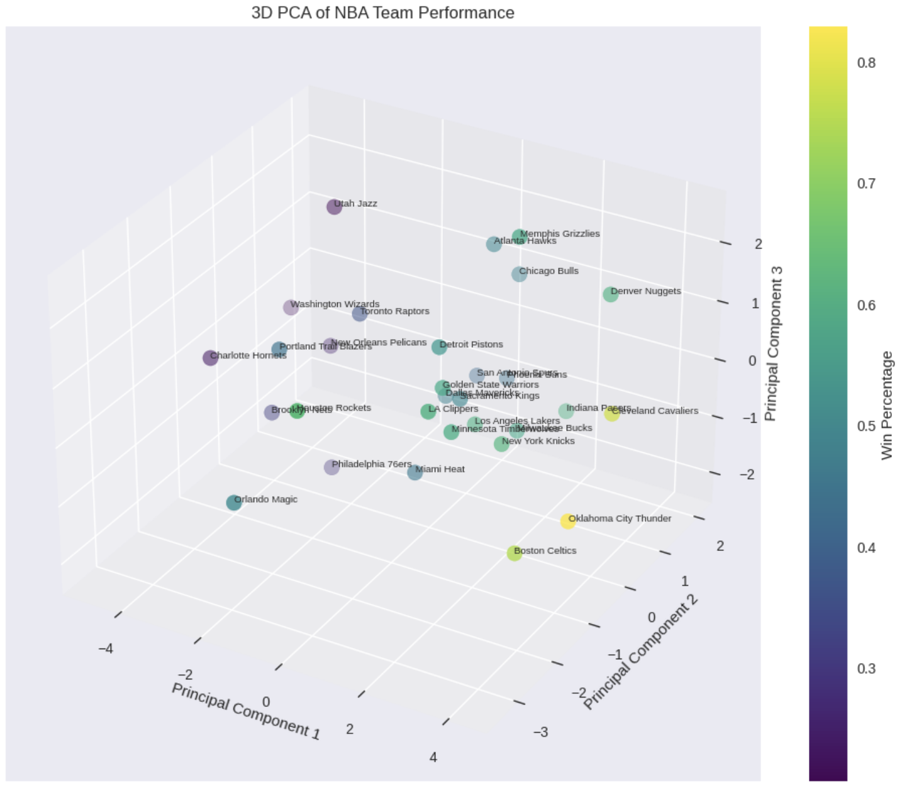

Principal Component Analysis (PCA) is a dimensionality reduction technique that transforms a large set of possibly correlated variables into a smaller set of uncorrelated components that capture most of the variation in the data. Instead of analyzing dozens of overlapping team statistics—such as points per game, field goal percentage, pace, turnovers, and defensive rating—PCA identifies underlying directions (principal components) that summarize the dominant patterns across those metrics. In the context of our NBA dataset, PCA helps simplify complex team performance profiles into a few interpretable dimensions, such as overall offensive strength or defensive efficiency, while retaining the majority of the information contained in the original variables. This makes it easier to visualize team differences, reduce noise before clustering, and understand which combinations of statistics explain the largest variation between teams and seasons.

## Cleaned Data for PCA

Note that the nba team name feature gets dropped before performing PCA, this was just to double check that my preprocessing was behaving as expected and a general overview of the full dataset that this script was working with.

  <strong>
    <a href="https://github.com/maxjwhite/csci5612ML-NBACode">PCA Script</a>
    &nbsp;|&nbsp;
    <a href="https://github.com/swar/nba_api">Link to Data</a>
  </strong>

---
## Visualizations

---
## Results

* How much information (what percentage ) remains in the 2D dataset. : **75.54%**  

* How much information (what percentage ) remains in the 3D dataset. : **86.93%**  

* How many dimensions do you need to have in your dataset (after using PCA) to retain at least 95% of the data. : **5 dimensions**

In order to find this, we have to keep adding features in descending order of importance until we reach 95% of the variance retained. This requires some trial and error as well as first visualizing the importance of all of our principal components in order.

* What are the top three eigenvalues of your data?  

---

