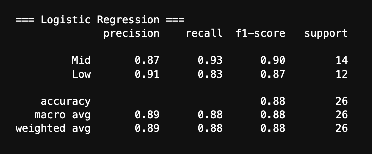
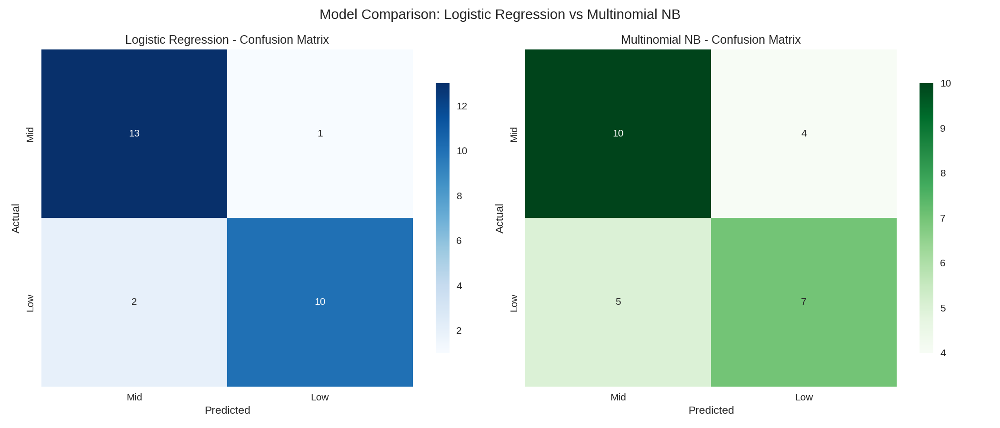

### (a) Linear Regression

Linear regression is a statistical method used to derive a function which represents the relationship between the predictor and outcome/target variable. A causal example of this might be this: say you wanted to investigate the relationship between the number of cars that would pass through an intersection and the number of accidents. In this case, the predictor would be number of cars and the target would be number of accidents and using linear regression, one could build a linear model which predicts number of accidents based on the number of cars. The goal of this model is to minimize the difference/error between the predictor and target by adjusting the coefficients which represent each predictor until a min point is reached. 

### (b) Logistic Regression

Logistic regression behaves very similarly to linear regression, but in this case it is used for binary classification or categorical classication. Using the same example as before, logistic regression rather than producing an exact number of predicted accidents, would return a score between 0-1 which would classify whether or not an accident would occur, where scores above/below a certain threshold would belong to a particular class. 

### (c) Similarities and Differences

The similarities between the two exist mostly in form, and they differ greatly in their application. Linear regression is used for estimations of continuous values, while log regression is used for estimation of categorical values. They both rely on the structure of using a linear combination of features as inputs to estimate a singular target output feature. Additionally, linear regression seeks to minimize mean squared error, while log regression uses MLE in order to fit their respective models. 

 
### (d) Sigmoid Function and Log Regression

Logistic regression uses the sigmoid function to transform a linear combination of features into a probability between 0-1, this is how the model is able to take in a collection of non probabilistic features and convert that into a probability used for classification. From here, based on the problem and discretion of the user, thresholds can be assigned and classes can be created based on those thresholds. 

### (e) MLE and Log Regression

As mentioned earlier, logistic regression uses MLE or Maximum Likelihood estimation in order to fit the model. What this means is that the model parameters are adjusted to a point where the data is most probable. This is an iterative process where parameters are adjusted until a point of convergence is reached. 

---
## Code

  <strong>
    <a href="https://github.com/maxjwhite/csci5612ML-NBACode">NB Script</a>
    &nbsp;|&nbsp;
    <a href="https://github.com/swar/nba_api">Link to Data</a>
  </strong>

---
## Results

The logistic regression model achieved strong performance in predicting NBA team winning tiers, with an overall accuracy of 88% on the test set. The model showed high precision and recall for both classes, correctly identifying most Mid tier teams while maintaining solid performance on Low tier teams. In comparison, the Multinomial Naive Bayes classifier performed more modestly, achieving only 65% accuracy, with lower precision and recall across both classes. The side-by-side confusion matrices clearly illustrate that logistic regression is better at capturing the differences between the two tiers, while Naive Bayes struggled, likely due to the non-negative input requirement and feature distribution. Overall, logistic regression demonstrates a reliable method for predicting team performance using advanced NBA statistics.

---
## Train / Test Split

    df = fetch_team_data()
    X, y, class_names, feature_names = prepare_data(df)

    X_train, X_test, y_train, y_test = train_test_split(
        X, y, test_size=0.2, random_state=42, stratify=y
    )

    scaler = StandardScaler()
    
    X_train_scaled = scaler.fit_transform(X_train)
    X_test_scaled = scaler.transform(X_test)


The importance of the train test split comes from its ability to verify the efficacy of the model. This technique which typically splits data into a 80% train and 20% test split allows the model to verify it's perfomance and in this case checks how effective the logistic regression classification is performing.

