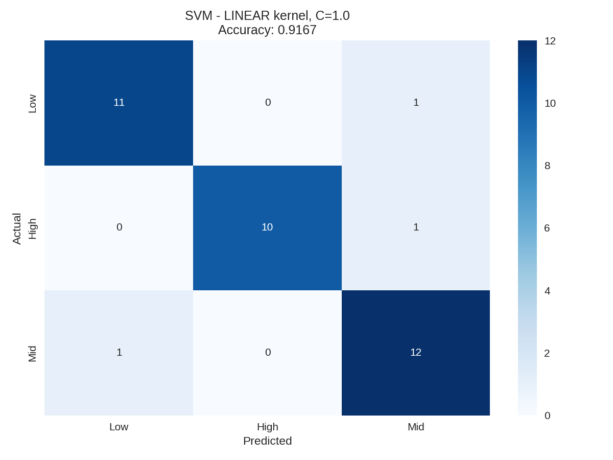
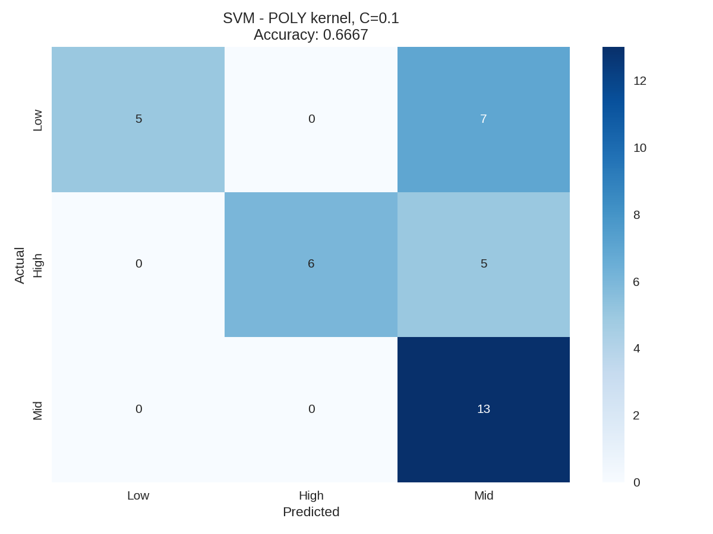
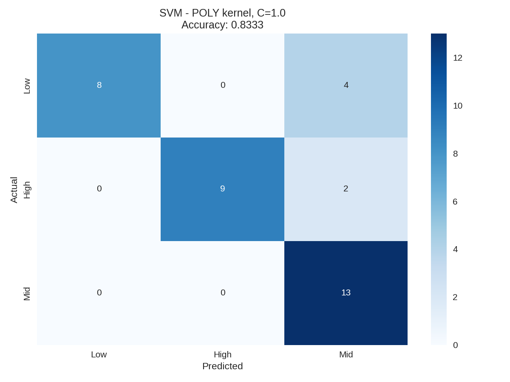
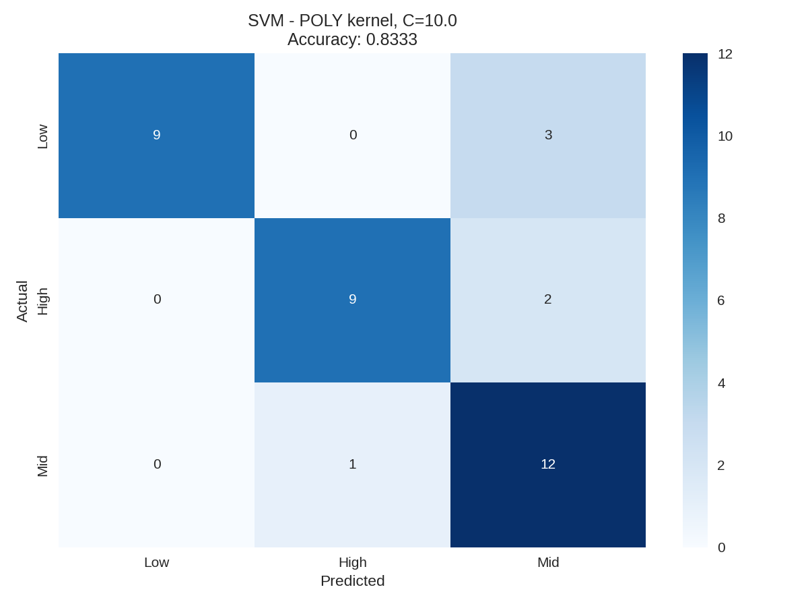
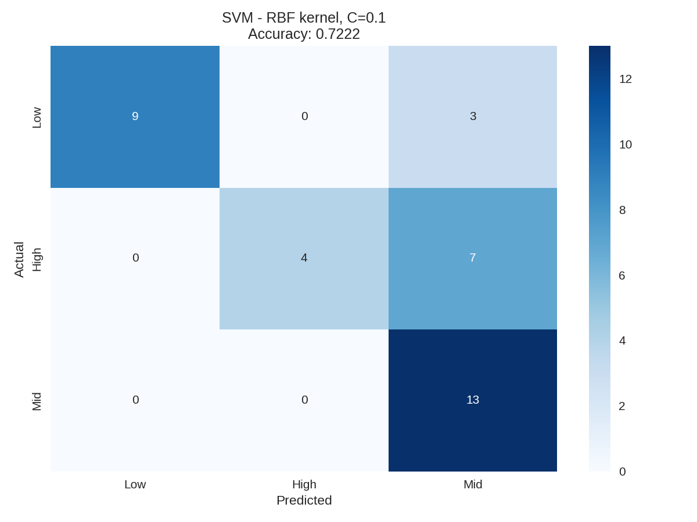

OVERVIEW

Support Vector Machines (SVMs) are models that try to separate data using a boundary (a line or plane) that best divides different groups, which is why they are often described as linear separators. The key idea is to maximize the margin—the distance between the boundary and the closest data points—so the separation is as robust as possible. When data is not easily separable in its original form, a kernel function is used to “transform” it into a higher-dimensional space where separation becomes easier, and this works efficiently because it relies on the dot product between points.

---
## Data Prep

In order to prepare our data for model training, there are a couple of steps that are necessary. For starters, SVM's only work on numeric data, so our set dropped all categorical/non numeric features. Following this step, it was important that we created a training/test split in order to verify the accuracy. It's important that these two sets are disjoint, otherwise our test set would exist in our model's training set and thus would skew accuracy. 

---
## Code

  <strong>
    <a href="https://github.com/maxjwhite/csci5612ML-NBACode">NB Script</a>
    &nbsp;|&nbsp;
    <a href="https://github.com/swar/nba_api">Link to Data</a>
  </strong>

---
## Results

Three different kernels were tested: linear, polynomial, and radial based. For each kernal, three different costs were tested: 0.1, 1, and 10.

The Support Vector Machine (SVM) models performed strongly in classifying teams into Low, Mid, and High win tiers, with clear differences across kernel choices and tuning parameters. The linear kernel produced consistently high accuracy, peaking at 91.67%, suggesting that much of the separation between team performance tiers can already be captured with relatively simple relationships in the data. The polynomial kernel showed moderate performance, reaching 83.33% accuracy, but struggled more with distinguishing between higher-performing teams, indicating that its added complexity did not translate into better classification.

The most notable results came from the radial basis function (RBF) kernel, which achieved the highest overall accuracy of 94.44% when paired with a higher regularization value (C = 10). This model demonstrated strong balance across all three classes, with especially high recall for Mid-tier teams and near-perfect precision for both Low and High tiers

---
## Conclusions

Overall, these results suggest that NBA team performance tiers are highly predictable using advanced statistical features, and that the relationships between these features are not purely linear. While simpler models like the linear SVM performed well, the superior performance of the RBF kernel indicates that nonlinear interactions between metrics such as efficiency, pace, and turnover rates play a meaningful role in distinguishing team success. This aligns with earlier findings from clustering and dimensionality reduction, which also pointed to the importance of combinations of factors rather than any single statistic.

